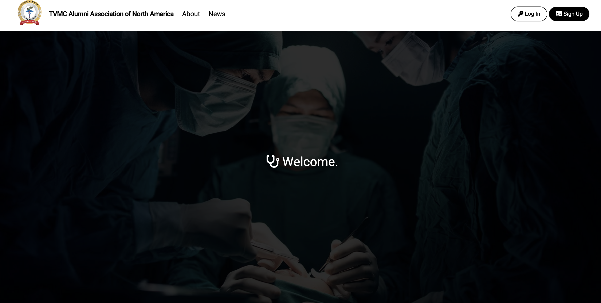
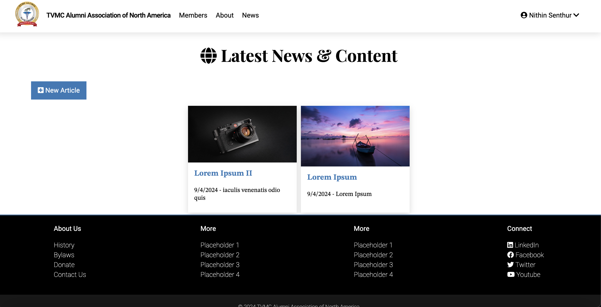
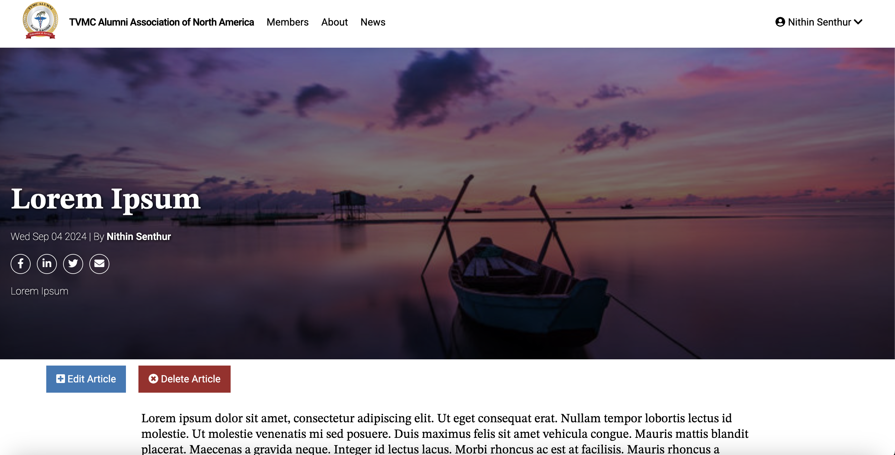
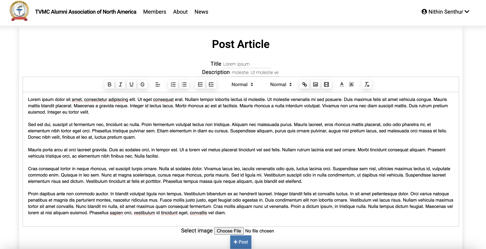

# TVMC-Website

## Description
A full-stack web application built using the MERN (MongoDB, Express, React, Node.js) stack. This application allows users to post, update, delete, and view articles, with features like user authentication, profile management, and phone/email verification.

## Features
- User registration and authentication (JWT-based)
- Create, update, delete, and view articles
- Manage and update user profiles
- Automated phone verification via Twilio
- Automated emails for password reset and account management using Nodemailer

## Screenshots







## Deployment

This project uses a continuous deployment (CI/CD) pipeline on GitHub Actions to automate the entire process from code push to deployment on an Amazon ECS cluster using AWS Fargate.

### Key Steps
1. **Containerized the Application**: The frontend and backend are containerized using Docker.
2. **Pushed Docker Images to Amazon ECR**: The Docker images are pushed to a private Amazon Elastic Container Registry (ECR).
3. **Created ECS Task Definitions**: ECS task definitions stored in an Amazon S3 bucket are retrieved during deployment.
4. **Deployed on Fargate**: The application is deployed as a service on an Amazon ECS Cluster, potentially using an Application Load Balancer (ALB) for managing traffic.
5. **Monitoring and Logging**: The application is monitored using AWS CloudWatch for logging and performance metrics.

## Getting Started

### Prerequisites
- MongoDB (local or cloud instance)
- Amazon S3 Bucket
- Nodemailer (for automated email handling)
- Twilio (for phone verification)

### Installation

1. Clone the repository:
   ```bash
   git clone https://github.com/nithinsenthur/TVMC-Website.git
   ```

2. Build containers for both the frontend and backend:
   ```bash
   # Build backend
   cd backend
   docker build -t tvmc-backend .

   # Build frontend
   cd ../frontend
   docker build -t tvmc-frontend .
   ```

3. Create a `.env` file in the `backend/` directory with the following:

     ```plaintext
     MONGO_URI=your-mongodb-connection-string
     TOKEN_SECRET=your-jwt-secret
     DB_URI=your-mongodb-connection-string
     DB=alumni
     PORT=port
     TWILIO_ACCOUNT_SID=account_sid
     TWILIO_AUTH_TOKEN=auth_token
     TWILIO_PHONE_NUMBER=phone_number
     AWS_BUCKET=bucket_name
     AWS_REGION=aws_region
     AWS_ACCESS_SECRET=access_secret
     AWS_ACCESS_KEY=access_key
     EMAIL_USERNAME=email_username
     EMAIL_PASS=email_pass
     ```

4. Run the application using Docker-Compose:
   ```bash
   docker-compose up
   ```
